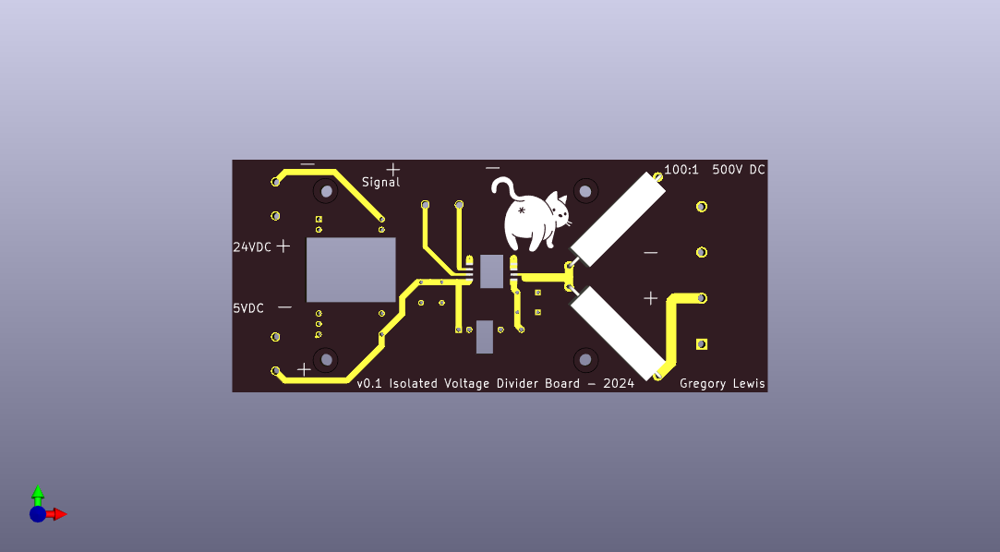
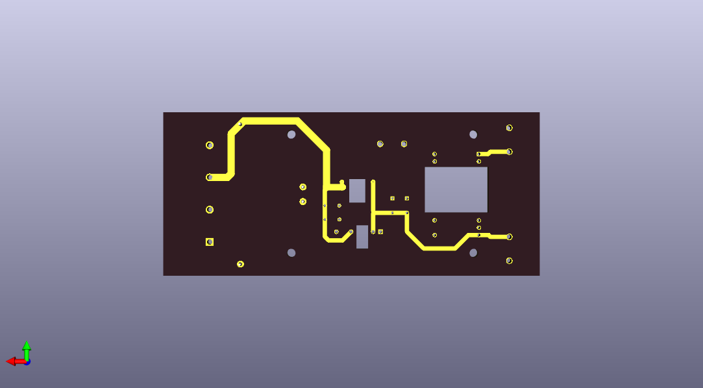

# WIP

A THC control board that can connect to a Expatria Flexihal for controlling a plasma cutter

I've highlighted BOMs for each major component, but I've left some things like hookup wires,
pins, etc to your own design and in particular your own plasma cutter.

## THC Divider Board

`thc_divider_board` directory contains a Kicad PCB designed to isolate the raw plasma cutter 
measurements from the MCU. The PCBs were designed with Oshpark in mind, in particular the
"After Dark" style just for fun. As such, there is minimal silkscreening.

The board is intended to be powered by an internal 24VDC power supply within the plasma cutter. The 
plasma cutter's power supply is protected by a 6KVDC reinforced DC-DC converter. The low-side of the 
isolation amplifier is powered by another isolation DC-DC converter fed from the main DC-DC 
converter. This secondary 5V DC-DC converter also provides power for the MCU.

The MCU is intended to be something like an Arduino Nano. Almost any other MCU would work but these
are cheap, small, and just fine for this application.

## Nano Voltage Sender

`nano_voltage_sender` contains the sketch for the Arduino Nano. It uses an external Vref voltage source
to normalize out the voltage for more accurate readings. It uses the 2V reference source to match the
0-2V output from the THC divider board.

The signal is connected to the ADC. The MCU is connected to a https://www.dfrobot.com/product-2588.html 
UART Fibre Optic Transceiver

BOM:

| Part    | Quantity | Notes |
| -------- | ------- | ----- |
| Arduino Nano | 1 | Or similar |
| UART Fiber Optic Transceiver | 1 | https://www.dfrobot.com/product-2588.html |
| LM4040 Voltage Reference | 1 | Or similar - eg: https://www.adafruit.com/product/2200 |
| Arduino Nano Screw Terminal Adapter | 1 | https://store-usa.arduino.cc/products/nano-screw-terminal is really nice |
| SC Fibre Optic Cable | 1 | Recommend duplex so you can fire a relay for plasma control |

## Teensy Quadrature Encoder

The `teensy_quadrature_encoder` directory contains the sketch for a Teensy 4 to convert from
serial to quadrature encoding. The Teensy 4 was chosen for its high speed and ability to measure nanoseconds 
for precise timings.  The quadrature encoding is then used to interface with a Expatria FlexiHAL and by 
extension LinuxCNC for torch height control. Similarly, this Teensy will also have a UART Fibre Optic 
Transceiver to talk to the Nano

BOM:

| Part    | Quantity | Notes |
| -------- | ------- | ----- |
| Teensy 4 | 1 | Or similar |
| UART Fiber Optic Transceiver | 1 | https://www.dfrobot.com/product-2588.html |
| Screw terminals | 8 | Have enough screw terminals for the uart serial, and power output, and quadrature encoder output |

## FlexiHAL Hookup and Configuration

BOM:

| Part    | Quantity | Notes |
| -------- | ------- | ----- |
| Ethernet cable, TIA 568B straight-through | 1 | |
| Flexihal! | 1 | Duh |

More to come :)
